 

<a href="https://your-portfolio.com"><code>[ portfolio ]</code></a> &nbsp;&bull;&nbsp;
<a href="https://linkedin.com/in/your-linkedin"><code>[ linkedin ]</code></a> &nbsp;&bull;&nbsp;
<a href="https://github.com/your-username"><code>[ github ]</code></a> &nbsp;&bull;&nbsp;
<a href="mailto:your-email@gmail.com"><code>[ email ]</code></a>

---

## `🌿` About Me

I'm an **AI Researcher** based in **Vietnam**, passionate about pushing the boundaries of Knowledge Graph research.

Currently serving as a **Teaching Assistant** at **Ton Duc Thang University**.

- 🔬 **Focus**: `Deep Learning` · `Knowledge Graph` · `Representation Learning`
- 🎓 **Education**: Ton Duc Thang University (TDTU)
- 🌐 **Languages**: Vietnamese (Native) · English (CEFR B2)

---

## `⚡` Tech Stack & Research Network

---

<!--  -->

