  

 

RESEARCH · LEARNING · TEACHING

<h1 align="center">AI Researcher &amp; Teaching Assistant</h1>

Vietnam &nbsp;·&nbsp; Ton Duc Thang University

  Exploring knowledge graphs and representation learning 
  through deep learning research.

 

### About

I'm an AI researcher based in Vietnam, with a focus on **knowledge graphs** and **representation learning**. I currently serve as a **Teaching Assistant at Ton Duc Thang University**, alongside my research interests in deep learning.

 

### Research interests

**Deep Learning** &nbsp; / &nbsp; **Knowledge Graph** &nbsp; / &nbsp; **Representation Learning**

 

### Background

- **Current role** — Teaching Assistant, Ton Duc Thang University
- **Education** — Ton Duc Thang University (TDTU)
- **Languages** — Vietnamese (native) · English (CEFR B2)

 

### Tools & technologies

Python, NumPy, scikit-learn, PyTorch and TensorFlow — connected to my research interests below.

  

<!-- Add verified portfolio, LinkedIn and email links here when available. -->
